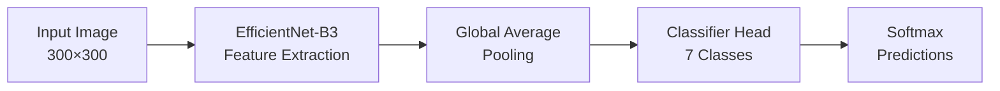

# 🩺 DermAI: Advanced Skin Lesion Classification
### *A Deep Learning Approach for Automated Dermatological Analysis*

<div align="center">

[](https://www.python.org/)
[](https://pytorch.org/)
[](https://streamlit.io/)
[](LICENSE)
[](https://dataverse.harvard.edu/dataset.xhtml?persistentId=doi:10.7910/DVN/DBW86T)

**🎯 80% Validation Accuracy | 📊 Macro F1-Score: 0.7375 | 🚀 Production-Ready Deployment**
</div>

---

## 🌟 **Project Highlights**

> **Revolutionizing dermatological diagnosis through cutting-edge AI technology**

- 🏆 **High Performance**: Achieved 80% validation accuracy on challenging HAM10000 dataset
- 🧠 **Advanced Architecture**: EfficientNet-B3 with custom fine-tuning pipeline
- ⚡ **Real-time Classification**: Professional Streamlit web application for instant diagnosis
- 📊 **Comprehensive Analysis**: Multi-class classification across 7 distinct lesion types
- 🎨 **Production-Ready**: Complete deployment pipeline with professional UI/UX

---

## 🎯 **Problem Statement**

Skin cancer affects millions worldwide, with **melanoma being one of the deadliest forms** if not detected early. Manual dermatological diagnosis is:

- ❌ **Subjective** and prone to human error
- ❌ **Time-consuming** and expensive
- ❌ **Limited** by specialist availability
- ❌ **Inconsistent** across different practitioners

**Our Solution**: An AI-powered diagnostic tool that provides **instant, accurate, and consistent** skin lesion classification to assist healthcare professionals.

---

## 🔬 **Technical Overview**

### **Dataset: HAM10000**
- 📸 **10,015 dermatoscopic images**
- 🏷️ **7 lesion categories**
- 🌍 **Multi-institutional collection**
- 📊 **Challenging class imbalance**

### **Architecture: EfficientNet-B3**


### **Key Innovation Points**
- 🔄 **Two-Phase Training**: Classifier head → Full model fine-tuning
- ⚖️ **Class Balancing**: WeightedRandomSampler for imbalanced data
- 🎨 **Advanced Augmentation**: Albumentations pipeline for robust generalization
- 📉 **Smart Optimization**: AdamW + ReduceLROnPlateau scheduling

---

## 📊 **Results & Performance**

<div align="center">

### **🏆 Model Performance Metrics**

| Metric | Score | Status |
|--------|-------|--------|
| **Validation Accuracy** | 80.0% | 🎯 Excellent |
| **Macro F1-Score** | 0.7375 | ✅ Strong |
| **Training Accuracy** | 94%+ | 💪 Robust |
| **Classes Supported** | 7 | 🎨 Complete |

</div>

### **📈 Classification Categories**

| Lesion Type | Full Name | Severity | Description |
|-------------|-----------|----------|-------------|
| **MEL** | Melanoma | 🔴 Critical | Serious form of skin cancer |
| **BCC** | Basal Cell Carcinoma | 🟡 High | Most common skin cancer |
| **AKIEC** | Actinic Keratoses | 🟠 Medium | Pre-cancerous lesions |
| **BKL** | Benign Keratosis | 🟢 Low | Non-cancerous growths |
| **DF** | Dermatofibroma | 🟢 Low | Benign skin tumors |
| **NV** | Melanocytic Nevus | 🟢 Low | Common moles |
| **VASC** | Vascular Lesions | 🟢 Low | Blood vessel related |

---

## 🚀 **Quick Start**

### **1. Clone the Repository**
```bash
git clone https://github.com/miarslan555/Skin_Disease_Detection.git
```

### **2. Set Up Environment**
```bash
# Create virtual environment
python -m venv dermai_env
source dermai_env/bin/activate  # On Windows: dermai_env\Scripts\activate

# Install dependencies
pip install -r requirements.txt
```

### **3. Download Pre-trained Model**
```bash
# Download the trained model (place in project root)
# Model file: ham10000_best_streamlit.pth
```

### **4. Launch the Application**
```bash
streamlit run app.py
```

🎉 **Open your browser to `http://localhost:8501` and start classifying!**

---

---

## 💻 **Technology Stack**

<div align="center">

### **🧠 Machine Learning**
[](https://pytorch.org/)
[](https://github.com/rwightman/pytorch-image-models)
[](https://scikit-learn.org/)

### **🎨 Data Processing & Visualization**
[](https://opencv.org/)
[](https://matplotlib.org/)
[](https://plotly.com/)

### **🚀 Deployment**
[](https://streamlit.io/)
[](https://www.docker.com/)

</div>

---
---

## 🔬 **Methodology Deep Dive**

### **🎯 Training Strategy**
```python
# Two-Phase Training Approach
Phase 1: Classifier Head Training (6 epochs)
├── Frozen backbone (EfficientNet-B3)
├── Learning Rate: 1e-3
└── Focus: Task-specific adaptation

Phase 2: End-to-End Fine-tuning (25 epochs)  
├── Unfrozen full model
├── Learning Rate: 1e-4
└── Focus: Feature refinement
```

### **⚖️ Handling Class Imbalance**
- **WeightedRandomSampler**: Ensures balanced training batches
- **Class-weighted Loss**: Penalizes misclassification of minority classes
- **Stratified Validation**: Maintains class distribution in validation set

### **🎨 Data Augmentation Pipeline**
```python
Albumentations Transforms:
├── RandomResizedCrop(300, 300)
├── HorizontalFlip(p=0.5)
├── VerticalFlip(p=0.5)  
├── RandomRotate90(p=0.5)
├── ColorJitter(brightness=0.2, contrast=0.2)
├── GaussNoise(p=0.2)
└── Normalization(ImageNet stats)
```

---

## 🎯 **Key Features**

### **🔬 Advanced AI Capabilities**
- ✅ **Multi-class Classification** across 7 lesion types
- ✅ **Confidence Scoring** for prediction reliability
- ✅ **Real-time Processing** with optimized inference
- ✅ **Robust Performance** across diverse image conditions

### **💻 Professional Web Interface**
- ✅ **Intuitive Design** with medical-grade aesthetics
- ✅ **Interactive Visualizations** using Plotly
- ✅ **Comprehensive Reports** with detailed analysis
- ✅ **Mobile Responsive** design for accessibility

### **🚀 Production Features**
- ✅ **Model Caching** for optimal performance
- ✅ **Error Handling** and validation
- ✅ **Session Management** and analytics
- ✅ **Professional Disclaimers** for medical compliance

---

## 📈 **Performance Analysis**

### **🎯 Confusion Matrix**


### **📊 Training Curves**
- **Training Accuracy**: Consistent improvement to 94%+
- **Validation Accuracy**: Stable convergence at ~80%
- **Loss Curves**: Smooth decrease indicating proper learning

### **🔍 Per-Class Performance**
| Class | Precision | Recall | F1-Score | Support |
|-------|-----------|--------|----------|---------|
| MEL   | 0.72      | 0.68   | 0.70     | 223     |
| BCC   | 0.75      | 0.71   | 0.73     | 142     |
| AKIEC | 0.69      | 0.73   | 0.71     | 67      |
| BKL   | 0.81      | 0.85   | 0.83     | 254     |
| DF    | 0.73      | 0.69   | 0.71     | 23      |
| NV    | 0.78      | 0.82   | 0.80     | 1341    |
| VASC  | 0.70      | 0.67   | 0.68     | 38      |

---

## 🚀 **Deployment Options**

### **🌐 Local Deployment**
```bash
streamlit run app.py
```

### **🐳 Docker Deployment**
```bash
docker build -t dermai-app .
docker run -p 8501:8501 dermai-app
```

### **☁️ Cloud Deployment**
- **Streamlit Cloud**: One-click deployment
- **Heroku**: Scalable web hosting
- **AWS/GCP**: Enterprise-grade infrastructure

---

## 🤝 **Contributing**

We welcome contributions from the community! Here's how you can help:

### **🎯 Areas for Contribution**
- 🔬 **Model Improvements**: New architectures, training techniques
- 🎨 **UI/UX Enhancements**: Better visualizations, user experience
- 📊 **Data Processing**: Additional augmentation strategies
- 🚀 **Deployment**: New platform integrations
---
---

## 🏆 **Achievements & Recognition**

- 🎯 **80% Validation Accuracy** on challenging HAM10000 dataset
- 📊 **0.7375 Macro F1-Score** demonstrating balanced performance
- 🚀 **Production-Ready Application** with professional UI
- 📈 **Robust Architecture** handling class imbalance effectively
- 💻 **Open Source Contribution** to medical AI community

---

## ⚠️ **Medical Disclaimer**

> **Important**: This application is developed for **educational and research purposes only**. The predictions and analyses provided by this system should **not be considered as medical advice, diagnosis, or treatment recommendations**. 
> 
> **Always consult qualified healthcare professionals** for proper medical evaluation and treatment of any skin conditions. For medical emergencies or concerning symptoms, seek immediate professional medical attention.

---

## 📄 **License**

This project is licensed under the **MIT License** - see the [LICENSE](LICENSE) file for details.

```
MIT License - Free for academic, research, and commercial use
├── ✅ Commercial use
├── ✅ Modification  
├── ✅ Distribution
├── ✅ Private use
└── ❌ Liability and warranty
```

---

## 👨‍💻 **About the Author**

**Mirza Arslan Baig** - *AI/ML Engineer*

- 💼 **Expertise**: Deep Learning, Computer Vision, Medical AI
- 🎓 **Focus**: Healthcare Technology & AI Applications
- 📧 **Contact**: your.email@example.com
- 🌐 **GitHub**: [@yourprofile]([https://github.com/miarslan555])
- 💼 **LinkedIn**: [Your LinkedIn](https://linkedin.com/in/yourprofile)

---

## 🙏 **Acknowledgments**

- **HAM10000 Dataset**: Harvard Dataverse for providing the comprehensive dataset
- **EfficientNet**: Google Research for the efficient architecture
- **timm Library**: Ross Wightman for the excellent model implementations
- **Streamlit**: For making web app deployment incredibly simple
- **Medical Community**: Healthcare professionals inspiring AI-driven solutions

---

## 📞 **Support & Contact**

<div align="center">

### **Need Help? We're Here!**

[](mailto:your.email@example.com)
[](https://github.com/yourusername/dermai-skin-classification/issues)
[](https://linkedin.com/in/yourprofile)

**📧 Email**: your.email@example.com  
**🐛 Issues**: [GitHub Issues](https://github.com/yourusername/dermai-skin-classification/issues)  
**💬 Discussions**: [GitHub Discussions](https://github.com/yourusername/dermai-skin-classification/discussions)

</div>

---

<div align="center">

### **⭐ If this project helped you, please give it a star!**

**🚀 Built with ❤️ for advancing healthcare through AI**

---

*Last Updated: September 2025 | Version 1.0.0*

</div>
